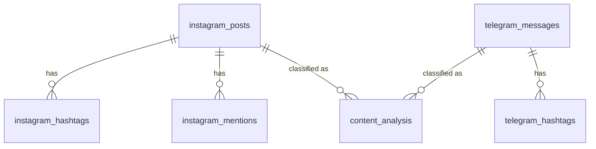

# Database Schema

PostParse uses SQLite. Default path: `data/social_media.db` (configurable in `config/config.toml`).

## Entity Relationship



## Tables

| Table | Purpose |
|-------|---------|
| `instagram_posts` | Posts with metadata |
| `instagram_hashtags` | Hashtags from captions |
| `instagram_mentions` | @mentions from captions |
| `telegram_messages` | Messages with metadata |
| `telegram_hashtags` | Hashtags from messages |
| `content_analysis` | Classification results |

## content_analysis

Polymorphic reference: `content_id` + `content_source` point to either `instagram_posts.id` or `telegram_messages.id`.

| Column | Purpose |
|--------|---------|
| `classifier_name` | `recipe_llm`, `multiclass_llm`, `multilabel_llm` |
| `classification_type` | `single` or `multi_label` |
| `run_id` | UUID grouping multi-label results |
| `label`, `confidence` | Classification output |
| `reasoning` | LLM reasoning (multi-class/multi-label) |
| `llm_metadata` | JSON: provider, model, temperature |
| `details_json` | JSON: cuisine_type, difficulty, etc. |

## Classifier Types

| classifier_name | CLI | Description |
|-----------------|-----|-------------|
| `recipe_llm` | `--classifier recipe` | Binary: recipe vs not-recipe |
| `multiclass_llm` | `--classifier multiclass` | Custom categories |
| `multilabel_llm` | `--classifier multilabel` | Multiple labels per item |

## Query Examples

```python
from backend.postparse.core.data.database import SocialMediaDatabase

db = SocialMediaDatabase("data/social_media.db")

# Get classifications for an item
results = db.get_classification_results(content_id=42, content_source="instagram")
for r in results:
    print(f"{r['label']} ({r['confidence']:.0%})")

# Check if already classified
if not db.has_classification(42, "instagram", "recipe_llm"):
    # Classify and save
    pass

# Multi-label by run_id
results = db.get_classification_results(42, "instagram", run_id="abc-123")
labels = [r["label"] for r in results]
```
