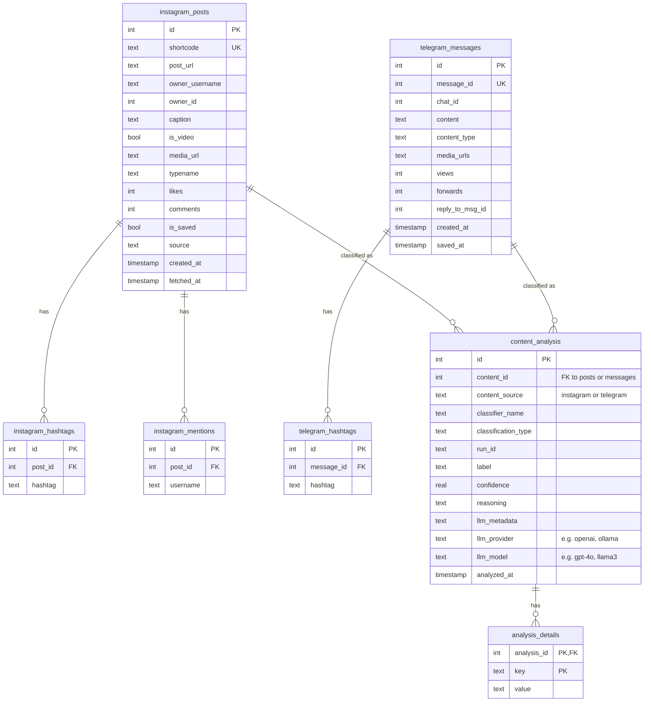

# Database Architecture

PostParse uses SQLite for storing social media content and classification results. All data is stored in a single database file (`data/social_media.db` by default).

## Entity Relationship Diagram



> **Note:** The `content_analysis` table uses a polymorphic reference pattern:
> - `content_id` references either `instagram_posts.id` or `telegram_messages.id`
> - `content_source` indicates which table (`'instagram'` or `'telegram'`)
> 
> This is a "soft" foreign key - not enforced by database constraints but maintained by application logic.

## Tables Overview

### Content Tables

| Table | Purpose |
|-------|---------|
| `instagram_posts` | Stored Instagram posts with metadata |
| `instagram_hashtags` | Hashtags extracted from Instagram post captions |
| `instagram_mentions` | @mentions extracted from Instagram post captions |
| `telegram_messages` | Stored Telegram messages with metadata |
| `telegram_hashtags` | Hashtags extracted from Telegram messages |

### Classification Tables

| Table | Purpose |
|-------|---------|
| `content_analysis` | Classification results linking to source content |
| `analysis_details` | Key-value storage for classification details |

## Classification Storage Design

### `content_analysis` Table

Stores the main classification record:

```sql
CREATE TABLE content_analysis (
    id INTEGER PRIMARY KEY AUTOINCREMENT,
    content_id INTEGER NOT NULL,           -- FK to instagram_posts.id or telegram_messages.id
    content_source TEXT NOT NULL,          -- 'instagram' or 'telegram'
    classifier_name TEXT NOT NULL,         -- e.g., 'recipe_llm', 'multi_class_llm'
    classification_type TEXT NOT NULL,     -- 'single' or 'multi_label'
    run_id TEXT,                           -- UUID for grouping multi-label results
    label TEXT NOT NULL,                   -- Classification label
    confidence REAL NOT NULL,              -- 0.0 to 1.0
    reasoning TEXT,                        -- LLM's reasoning for the classification
    llm_metadata TEXT,                     -- JSON: provider, model, temperature, etc.
    llm_provider TEXT,                     -- Extracted for easy querying (e.g., 'openai')
    llm_model TEXT,                        -- Extracted for easy querying (e.g., 'gpt-4o')
    analyzed_at TIMESTAMP DEFAULT CURRENT_TIMESTAMP
);
```

> **Note:** The `llm_provider` and `llm_model` columns are automatically extracted from `llm_metadata` when saving classifications. This enables easy querying and filtering by model without parsing JSON.

### `analysis_details` Table

Stores flexible key-value pairs for classification details:

```sql
CREATE TABLE analysis_details (
    analysis_id INTEGER NOT NULL,          -- FK to content_analysis.id
    key TEXT NOT NULL,                     -- e.g., 'cuisine_type', 'reasoning'
    value TEXT NOT NULL,                   -- JSON-encoded value
    FOREIGN KEY(analysis_id) REFERENCES content_analysis(id),
    PRIMARY KEY(analysis_id, key)
);
```

## Classifier Types

PostParse supports different classifiers, each stored with a unique `classifier_name`:

| Classifier Name | CLI Command | Description |
|-----------------|-------------|-------------|
| `recipe_llm` | `classify db --classifier recipe` | Binary: recipe vs non-recipe |
| `multiclass_llm` | `classify db --classifier multiclass` | Custom categories |
| `multilabel_llm` | (future) | Multiple labels per content |

### Recipe Classifier (`recipe_llm`)

Binary classification (recipe vs non-recipe):

```
content_analysis:
| id | content_id | content_source | classifier_name | label      | confidence | reasoning |
|----|------------|----------------|-----------------|------------|------------|-----------|
| 1  | 42         | instagram      | recipe_llm      | recipe     | 0.95       | NULL      |
| 2  | 43         | instagram      | recipe_llm      | not_recipe | 0.88       | NULL      |
```

Note: Recipe classifier doesn't currently generate reasoning (column is NULL).

Details stored in `analysis_details`: `cuisine_type`, `difficulty`, `meal_type`, `ingredients_count`

### Multi-Class Classifier (`multiclass_llm`)

Custom categories defined via `--classes`:

```
content_analysis:
| id | content_id | content_source | classifier_name   | label     | confidence | reasoning                        |
|----|------------|----------------|-------------------|-----------|------------|----------------------------------|
| 1  | 42         | instagram      | multiclass_llm    | tech_news | 0.92       | "Discusses new software release" |
| 2  | 43         | telegram       | multiclass_llm    | recipe    | 0.85       | "Contains cooking instructions"  |
```

Reasoning is stored directly in the `reasoning` column. Additional details stored in `analysis_details`: `available_classes`

### Multi-Label Classification (Future)

Multiple labels per content item, grouped by `run_id`:

```
content_analysis:
| id | content_id | content_source | classifier_name   | classification_type | run_id   | label      | confidence | reasoning                          |
|----|------------|----------------|-------------------|---------------------|----------|------------|------------|------------------------------------|
| 1  | 42         | instagram      | multilabel_llm    | multi_label         | abc-123  | recipe     | 0.95       | "Contains cooking instructions"    |
| 2  | 42         | instagram      | multilabel_llm    | multi_label         | abc-123  | italian    | 0.88       | "Uses Italian ingredients"         |
| 3  | 42         | instagram      | multilabel_llm    | multi_label         | abc-123  | vegetarian | 0.72       | "No meat products mentioned"       |
```

Each label can have its own reasoning explaining why that label was assigned.

## LLM Metadata Storage

The `llm_metadata` column stores JSON with the LLM configuration used:

```json
{
    "provider": "lm_studio",
    "model": "qwen/qwen3-vl-8b",
    "temperature": 0.7,
    "max_tokens": 1000,
    "timeout": 60,
    "api_base": "http://localhost:1234/v1"
}
```

This enables:
- **Reproducibility**: Know exactly which model produced each result
- **Comparison**: Compare results across different models
- **Auditing**: Track model versions over time

## Details Storage (Key-Value)

Classification details (other than reasoning) are stored as key-value pairs in `analysis_details`:

```
analysis_details:
| analysis_id | key               | value      |
|-------------|-------------------|------------|
| 1           | cuisine_type      | "italian"  |
| 1           | difficulty        | "easy"     |
| 1           | meal_type         | "dinner"   |
| 2           | available_classes | "[\"tech_news\", \"recipe\", \"other\"]" |
```

Note: `reasoning` is stored directly in `content_analysis.reasoning`, not in `analysis_details`.

Nested details are flattened with dot notation:

```python
# Input
details = {
    "ingredients": {
        "count": 5,
        "main": "pasta"
    }
}

# Stored as:
# | analysis_id | key               | value   |
# |-------------|-------------------|---------|
# | 1           | ingredients.count | 5       |
# | 1           | ingredients.main  | "pasta" |
```

## Querying Examples

### Get all classifications for an Instagram post

```python
from backend.postparse.core.data.database import SocialMediaDatabase

db = SocialMediaDatabase("data/social_media.db")
results = db.get_classification_results(
    content_id=42,
    content_source="instagram"
)
for r in results:
    print(f"{r['label']} ({r['confidence']:.0%})")
    if r['reasoning']:
        print(f"  Reasoning: {r['reasoning']}")
    print(f"  Model: {r['llm_metadata']['model']}")
```

### Check if content is already classified

```python
# Check for any classification by this classifier
if not db.has_classification(42, "instagram", "recipe_llm"):
    # Classify and save
    result = classifier.predict(text)
    
    # Extract reasoning from details if present
    reasoning = result.details.pop('reasoning', None) if result.details else None
    
    db.save_classification_result(
        content_id=42,
        content_source="instagram",
        classifier_name="recipe_llm",
        label=result.label,
        confidence=result.confidence,
        details=result.details,
        reasoning=reasoning,
        llm_metadata=classifier.get_llm_metadata()
    )

# Check for classification with specific model (more precise)
model = classifier.get_llm_metadata().get('model')
if not db.has_classification(42, "instagram", "recipe_llm", llm_model=model):
    # Classify with this model specifically
    pass
```

### Update existing classification

```python
# Find existing classification ID
existing_id = db.get_classification_id(42, "instagram", "recipe_llm", llm_model="gpt-4o")

if existing_id:
    # Update existing record (for --force --replace behavior)
    db.update_classification(
        analysis_id=existing_id,
        label=new_result.label,
        confidence=new_result.confidence,
        reasoning=new_result.details.get('reasoning'),
        llm_metadata=classifier.get_llm_metadata()
    )
```

### Get multi-label results by run_id

```python
results = db.get_classification_results(
    content_id=42,
    content_source="instagram",
    run_id="abc-123-uuid"
)
labels = [r["label"] for r in results]
# ['recipe', 'italian', 'vegetarian']
```

## CLI Usage

### Recipe Classification

```bash
# Classify all content (Instagram + Telegram)
postparse classify db --limit 100

# Classify only Instagram posts
postparse classify db --source instagram --limit 100

# Classify only Telegram messages
postparse classify db --source telegram --provider openai
```

### Multi-Class Classification

```bash
# Classify with custom categories
postparse classify db --classifier multiclass \
  --classes '{"recipe": "Cooking", "tech": "Technology", "other": "Other"}'

# Load classes from file
postparse classify db --classifier multiclass --classes @classes.json
```

### View Results

Classification results are saved to the database. Query them with:

```python
db = SocialMediaDatabase("data/social_media.db")
results = db.get_classification_results(content_id=42, content_source="instagram")
```

## Configuration

Database path is configured in `config/config.toml`:

```toml
[database]
default_db_path = "data/social_media.db"
```

